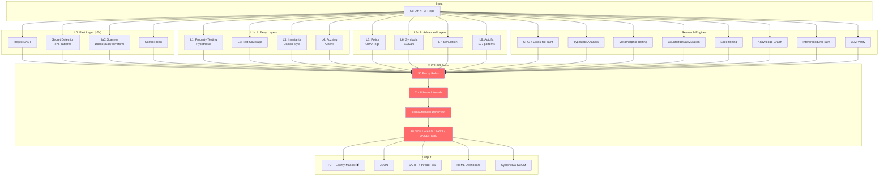

# LoomScan v5.9 🕷️

> Static + Test + Constraint Analysis — 2,095 rules across 40 packs covering 24 languages, 107 auto-fix patterns, 275 secret detection patterns, 10 unique differentiators, 78 CLI commands. Free, offline, production-ready. Pixel art spider mascot with inline-image support (Kitty, iTerm2, WezTerm, VS Code, Ghostty). Rich-powered progress bar. Rust core for 10-50× faster scanning.

<p align="center">
  
</p>

<h1 align="center">LoomScan</h1>

<p align="center">
  <a href="https://github.com/Daveshvats/loomscan/actions"></a>
  <a href="https://pypi.org/project/loomscan/"></a>
  <a href="https://pypi.org/project/loomscan/"></a>
  <a href="LICENSE"></a>
  <a href="https://github.com/Daveshvats/loomscan"></a>
</p>

<p align="center">
  <a href="#-quick-start">Quick Start</a> ·
  <a href="#-installation">Installation</a> ·
  <a href="#-features">Features</a> ·
  <a href="#-architecture">Architecture</a> ·
  <a href="GUIDE.md">Full Guide</a>
</p>

---

## 🕷️ What is LoomScan?

LoomScan is a **free, offline, multi-language static analysis pipeline** that detects bugs, security vulnerabilities, and code quality issues across **24 programming languages**. It uses an **Interval Type-2 Fuzzy Inference System** (IT2-FIS) to aggregate findings from 42+ detection engines into confidence-interval-based decisions — no other SAST tool does this.

The spider mascot ("Loomy") weaves a web of analysis, with an animated progress bar showing scan stages and inline-image rendering on modern terminals (Kitty, iTerm2, WezTerm, VS Code, Ghostty).

### Why LoomScan?

| Capability | LoomScan | Semgrep | SonarQube | Qodana |
|---|:---:|:---:|:---:|:---:|
| **FIS confidence intervals** | ✅ | ❌ | ❌ | ❌ |
| **LLM-verify by execution** | ✅ | ❌ | ❌ | ❌ |
| **Counterfactual mutation** | ✅ | ❌ | ❌ | ❌ |
| **Metamorphic testing** | ✅ | ❌ | ❌ | ❌ |
| **Knowledge graph + blast radius** | ✅ | ❌ | ❌ | ❌ |
| **Rule auto-mining from git history** | ✅ | ❌ | ❌ | ❌ |
| **Spec mining (adaptive patterns)** | ✅ | ❌ | ❌ | ❌ |
| **9-level strictness (PHPStan-style)** | ✅ | ❌ | ❌ | ❌ |
| **`--uncertain` flag (30-70% band)** | ✅ | ❌ | ❌ | ❌ |
| **Free + offline** | ✅ | ✅ CE | ⚠️ CE limits | ❌ Paid |
| **Languages** | **24** | 30+ | 30+ | 60+ |
| **Rules** | **2,095** | 3,000+ | 5,000+ | 3,000+ |
| **Autofix patterns** | **107** | ~50 | ~200 | ~300+ |
| **Secret detection** | **275** | 200+ | Enterprise | ✅ |

---

## 🚀 Quick Start

```bash
# Install
pip install loomscan

# One-command quickstart (creates config, runs scan, shows summary)
loomscan quickstart /path/to/your/code
```

That's it. LoomScan will:
1. ✅ Create a `.loomscan.yaml` config
2. 🔍 Run a full scan (all 42 engines)
3. 📊 Show a summary of findings by severity
4. 📋 Print next steps

```
==================================================
  LoomScan Quick Start — Scan Complete
==================================================
  Total findings: 14
  Critical: 0
  High:     1
  Medium:   3
  Low:      10
  Decision: warn
==================================================

📋 Next steps:
  1. View detailed findings:  loomscan check --full --summary
  2. View JSON output:        loomscan check --full --json
  3. Generate dashboard:      loomscan dashboard --repo .
  4. Run quality gate:        loomscan gate --full --preset balanced
  5. Apply auto-fixes:        loomscan fix --apply
```

---

## 📦 Installation

LoomScan uses a **3-tier installation model** — start basic, add features as needed:

### Tier 1: Core (5 seconds, pure Python, works everywhere)

```bash
pip install loomscan
```

- All 2,095 rules (1,995 in v5.4, now 2,095 with framework taint pack), 78 CLI commands, IT2-FIS brain
- No compilation, no Rust, no tree-sitter
- Works on Linux, macOS, Windows (Python 3.9+)

### Tier 2: Full Analysis (adds tree-sitter for CPG/def-use chains)

```bash
pip install loomscan[full]
```

- Everything in Tier 1, plus:
- Tree-sitter grammars for 8 languages (deep CPG/taint tracking)
- Hypothesis for property-based testing
- pip-audit for supply chain CVE checks

### Tier 3: Performance (adds Rust core for 10-50× faster scanning)

```bash
pip install loomscan[fast]
```

- Everything in Tier 2, plus:
- `loomscan-regex` Rust core (10-50× faster YAML rule scanning)
- Pre-built binary wheels — no Rust compiler needed

### Verify your install

```bash
loomscan doctor
```

```
LoomScan v5.9.0 — health check
  Python:      3.12.1 (x86_64)
  Platform:    Linux 6.5.0

Tier 1 — Core (always required):
  [OK]   click, rich, yaml, jsonschema, numpy, scikit-fuzzy

Tier 2 — Full analysis (tree-sitter, optional):
  [OK]   tree_sitter_python, tree_sitter_javascript, ...
  → All 8 tree-sitter grammars installed

Tier 3 — Rust core (10-50x faster scanning, optional):
  [OK]   loomscan-regex active
  → YAML engine: Rust core (10-50x faster)

YAML engine:
  Rust core active: True
  Rule packs: 40 packs, 2095 total rules
```

---

## ✨ Features

### 10 Unique Differentiators (no competitor has these)

| # | Feature | What It Does |
|---|---|---|
| 1 | **🧠 IT2-FIS Brain** | Type-2 fuzzy inference with 50 rules. Produces confidence *intervals* (not point scores). Aggregates severity, confidence, blast radius, exploitability into BLOCK/WARN/PASS/UNCERTAIN. |
| 2 | **🤖 LLM-Verify** | LLM proposes hypotheses ("function crashes on None"); LoomScan verifies by *execution*. Only confirmed bugs are reported. PRM-gated. |
| 3 | **🔄 Counterfactual Mutation** | Mutates code (removes lines, injects guards) and re-runs detectors. If finding disappears → true positive (boost). If it persists → false positive (demote). 9 languages. |
| 4 | **🔬 Metamorphic Testing** | Oracle-free bug detection: `sort(sort(x)) == sort(x)`. Catches semantic bugs no oracle can. JS/Java/Go. |
| 5 | **🕸️ Knowledge Graph** | Builds a codebase graph (1,400+ nodes). `loomscan impact --changed file.py` shows blast radius. |
| 6 | **⛏️ Rule Auto-Mining** | `loomscan mine` scans git history for bug-fix commits and auto-generates Semgrep rules. Every bug you've fixed becomes a permanent rule. |
| 7 | **📐 Spec Mining** | `loomscan spec` mines API usage patterns from your codebase and flags deviations. Adaptive — learns from your code. |
| 8 | **🎯 `--uncertain` Flag** | Shows only 30-70% confidence findings — the ones worth human review. |
| 9 | **📊 9-Level Strictness** | PHPStan-inspired levels (1-9). Level 1 = critical only; Level 9 = everything. |
| 10 | **⚡ Rust Core** | Optional Rust regex engine for 10-50× faster YAML rule scanning. Pre-built wheels. |

### Spider Mascot + Progress Bar

LoomScan features "Loomy" — an animated ASCII spider mascot that weaves a web while scanning. On modern terminals (Kitty, iTerm2, WezTerm, VS Code, Ghostty), Loomy renders as a real PNG image via inline-image protocols. The progress bar shows all 12 scan stages with live finding counts.

```bash
# Disable the mascot + progress bar for CI/CD
loomscan check --full --no-tui

# Or use env var
LOOMSCAN_NO_TUI=1 loomscan check --full
```

### Detection Coverage

| Category | Count | Details |
|----------|-------|---------|
| **YAML pack rules** | 2,095 | 40 packs across 24 languages (was 1,995 in v5.4) |
| **Autofix patterns** | 107 | Python, JS, K8s, Docker, Rust, Java, Go, Kotlin, SQL, Bash, Dart, Swift, Scala |
| **Secret patterns** | 275 | AWS, GitHub, Stripe, Slack, OpenAI, GCP, Azure, 200+ services |
| **Taint sinks** | 88 | eval, exec, system, SQL, render, deserialization, path traversal |
| **Interprocedural KB** | 200 | Python (18), JavaScript (78), Java (30), Go (69), C++ (5) |
| **Typestate protocols** | 5 | file, connection, payment, session, transaction |
| **CPG queries** | 6 | taint flows, def-use chains, cross-function taint, unused vars, auth patterns, complexity |
| **CLI commands** | 78 | check, gate, impact, lsp, bot, playground, monorepo, mine, spec, rules, fix, ... |

---

## 🏗️ Architecture



### Pipeline Flow

```
┌─────────────────────────────────────────────────────────────────┐
│                    LoomScan Pipeline                             │
├─────────────────────────────────────────────────────────────────┤
│                                                                  │
│  ┌─────────┐  ┌─────────┐  ┌─────────┐  ┌─────────┐           │
│  │  L0     │  │  L1-L4  │  │  L5-L8  │  │ Research│           │
│  │  Fast   │  │  Deep   │  │ Advanced│  │ Engines │           │
│  │ <5s     │  │         │  │         │  │         │           │
│  └────┬────┘  └────┬────┘  └────┬────┘  └────┬────┘           │
│       │            │            │            │                  │
│       └────────────┴────────────┴────────────┘                  │
│                         │                                        │
│                    ┌────▼────┐                                   │
│                    │ IT2-FIS │  ← 50 fuzzy rules                 │
│                    │  Brain  │  ← Confidence intervals           │
│                    └────┬────┘                                   │
│                         │                                        │
│              ┌──────────┼──────────┐                             │
│              ▼          ▼          ▼                             │
│         ┌────────┐ ┌────────┐ ┌────────┐                        │
│         │ BLOCK  │ │  WARN  │ │  PASS  │                        │
│         │  (1)   │ │  (0)   │ │  (0)   │                        │
│         └────────┘ └────────┘ └────────┘                        │
│                                                                  │
└─────────────────────────────────────────────────────────────────┘
```

---

## 🌍 Supported Languages (24)

| Language | Rules | CPG | Taint | Typestate | Autofix |
|----------|:-----:|:---:|:-----:|:---------:|:-------:|
| **Python** | 250 | ✅ | ✅ | ✅ | ✅ |
| **JavaScript/TS** | 312 | ✅ | ✅ | ✅ | ✅ |
| **Java** | 222 | ✅ | ✅ | ✅ | ✅ |
| **C/C++** | 94 | ✅ | ⚠️ | ✅ | ✅ |
| **Go** | 49 | ✅ | ⚠️ | ✅ | ✅ |
| **Rust** | 61 | ⚠️ | ⚠️ | ❌ | ✅ |
| **PHP** | 102 | ❌ | ❌ | ❌ | ✅ |
| **Ruby** | 79 | ❌ | ❌ | ❌ | ✅ |
| **C#** | 51 | ❌ | ❌ | ❌ | ❌ |
| **Swift** | 30 | ❌ | ❌ | ❌ | ✅ |
| **Scala** | 30 | ❌ | ❌ | ❌ | ✅ |
| **Kotlin** | 50 | ❌ | ❌ | ❌ | ✅ |
| **SQL** | 91 | ❌ | ❌ | ❌ | ✅ |
| **Bash** | 92 | ❌ | ❌ | ❌ | ✅ |
| **Dart** | 30 | ❌ | ❌ | ❌ | ✅ |
| **Lua** | 35 | ❌ | ❌ | ❌ | ❌ |
| **R** | 35 | ❌ | ❌ | ❌ | ❌ |
| **Haskell** | 30 | ❌ | ❌ | ❌ | ❌ |
| **Elixir** | 30 | ❌ | ❌ | ❌ | ❌ |
| **Objective-C** | 30 | ❌ | ❌ | ❌ | ❌ |
| **Groovy** | 30 | ❌ | ❌ | ❌ | ❌ |
| **Julia** | 30 | ❌ | ❌ | ❌ | ❌ |
| **Perl** | 30 | ❌ | ❌ | ❌ | ❌ |
| **COBOL** | 25 | ❌ | ❌ | ❌ | ❌ |

---

## 🖥️ IDE Integration

### VS Code

```bash
# Install from VSIX (pre-built in repo)
code --install-extension editor/vscode-loomscan/loomscan-0.2.0.vsix
```

Features:
- Real-time diagnostics via LSP
- Hover for rule documentation + fix suggestions
- Code actions ("Apply LoomScan fix")
- 17 language activations

### JetBrains (IntelliJ, PyCharm, WebStorm, etc.)

```bash
# Build from source (CI builds automatically)
cd editor/intellij-loomscan
./gradlew buildPlugin
# Install: Settings → Plugins → ⚙️ → Install from Disk → build/distributions/*.zip
```

### LSP Server (any editor)

```bash
loomscan lsp --repo .
```

Works with Neovim, Emacs, Sublime Text, Helix, and any LSP-compatible editor.

---

## 📊 CLI Commands (78)

<details>
<summary><strong>Click to expand full command list</strong></summary>

| Category | Commands |
|----------|----------|
| **Core** | `check`, `quickstart`, `gate`, `dashboard`, `fix`, `doctor` |
| **IDE** | `lsp`, `watch` |
| **Analysis** | `cpg`, `taint`, `typestate`, `metamorphic`, `differential`, `deadcode`, `duplicates`, `hotspot`, `pii`, `architecture`, `doc-audit`, `nullness`, `contracts`, `concurrency`, `crypto`, `flawfinder`, `malicious`, `rca`, `impact`, `spec` |
| **Rules** | `rules`, `mine`, `rules-config`, `rule-lint`, `similar` |
| **CI/CD** | `bot`, `pre-commit`, `sbom`, `history-scan`, `missing-patches`, `update-cves`, `maven-cve`, `supply-chain`, `ffi-check` |
| **Quality** | `strictness`, `profile`, `baseline`, `suppressions`, `tuning`, `precision`, `feedback`, `issue`, `runs`, `cache`, `coverage`, `toxicity`, `trace`, `optimize`, `gnn`, `dashboard`, `behavioral`, `code-quality`, `config-scan`, `consistency`, `business-logic`, `source-discovery`, `modern`, `iac`, `js-multiline`, `js-quality`, `ast-analysis`, `symbolic`, `taint-analysis` |

</details>

### Most-used commands

```bash
# Scan a git diff (fast, for PRs)
loomscan check

# Full repo scan
loomscan check --full

# Grouped summary (compact output)
loomscan check --full --summary

# JSON output (for CI/CD)
loomscan check --full --json

# SARIF output (for GitHub Code Scanning)
loomscan check --full --sarif --output loomscan.sarif

# Show only uncertain findings (30-70% confidence)
loomscan check --full --uncertain

# Quality gate (SonarQube-style)
loomscan gate --full --preset strict

# Blast radius analysis
loomscan impact --changed src/app.py

# Apply auto-fixes
loomscan fix --apply

# Generate HTML dashboard
loomscan dashboard --repo .

# Run rule auto-mining on git history
loomscan mine --repo . --max-commits 100

# Run spec mining (adaptive API pattern learning)
loomscan spec --repo .
```

---

## 🔧 Configuration

Create a `.loomscan.yaml` in your repo root (or run `loomscan quickstart`):

```yaml
# LoomScan configuration
strictness: 5  # 1-9 (PHPStan-style)

# Enable/disable engines
layers:
  L0_fast:
    enabled: true
  L1_property:
    enabled: false  # requires hypothesis
  L4_fuzz:
    enabled: false  # requires atheris

# Quality gate thresholds
gate:
  max_critical: 0
  max_high: 5
  min_coverage: 80

# Monorepo workspaces (optional)
workspaces:
  - "apps/*"
  - "packages/*"
  - "!apps/legacy"

# FP learning (default: off)
fp_learn_mode: false
```

---

## 📈 GitHub Actions Integration

```yaml
# .github/workflows/loomscan.yml
name: LoomScan
on:
  pull_request:
    branches: [main, master]
  push:
    branches: [main, master]

jobs:
  loomscan:
    runs-on: ubuntu-latest
    permissions:
      contents: read
      security-events: write
    steps:
      - uses: actions/checkout@v4
        with:
          fetch-depth: 0
      - uses: actions/setup-python@v5
        with:
          python-version: '3.12'
      - run: pip install loomscan
      - run: loomscan check --sarif --output loomscan.sarif --full --strictness 5 || true
      - uses: github/codeql-action/upload-sarif@v3
        if: always()
        with:
          sarif_file: loomscan.sarif
      - name: Fail on critical only
        if: always()
        run: |
          python3 -c "
          import json
          with open('loomscan.sarif') as f:
              data = json.load(f)
          for run in data.get('runs', []):
              for result in run.get('results', []):
                  sev = result.get('properties', {}).get('severity', '').lower()
                  if sev == 'critical':
                      print(f'CRITICAL: {result.get(\"ruleId\")}')
                      exit(1)
          print('No critical findings')
          "
```

---

## 🧪 Test Suite

```bash
# Run all tests
python -m pytest tests/ -q

# Current status: 915 passed, 37 skipped, 0 failed
```

| Test Category | Count | Purpose |
|---|---|---|
| Regression probes (v4.3-v4.14) | 150+ | Prevents historical bugs from returning |
| Smoke tests (v4.33-v5.9) | 350+ | E2E verification of every feature |
| Engine tests | 200+ | Individual engine correctness |
| Integration tests | 100+ | Cross-engine corroboration |
| Precision tests | 100+ | FIS aggregation + Bayesian |

---

## 📚 Documentation

- **[GUIDE.md](GUIDE.md)** — Full 1,300-line user guide (installation, all 78 commands, configuration, examples)
- **[RESEARCH_BUSINESS_LOGIC.md](RESEARCH_BUSINESS_LOGIC.md)** — Business logic detection research
- **[RESEARCH_FRONTIER_SOLUTIONS.md](RESEARCH_FRONTIER_SOLUTIONS.md)** — Cutting-edge detection techniques
- **[RESEARCH_MULTI_LANGUAGE_BL.md](RESEARCH_MULTI_LANGUAGE_BL.md)** — Multi-language business logic research

---

## 📝 Version History

- **v5.9** — Premium mascot (inline-image: Kitty/iTerm2/WezTerm/VS Code/Ghostty), doctor skfuzzy fix, `--version` flag
- **v5.8** — 3-tier install model, `loomscan doctor`, Rust wheel CI, spider mascot redesign (8 frames)
- **v5.7** — TUI mascot + progress bar, Rust core pyo3 bindings, incremental CPG caching
- **v5.6** — Multi-language taint sources/sinks/sanitizers (JS/Java/Go), interprocedural KB 4× expansion
- **v5.5** — Critical YAML wiring fix (all 2,095 rules now fire), Rust core source, cleanup
- **v5.4** — Multi-lang CPG def-use chains, SARIF Pro tier (threadFlow), rename to LoomScan
- **v5.3** — Multi-lang metamorphic testing, multi-lang LLM-verify, SARIF Pro tier
- **v5.2** — Native YAML rule engine (no semgrep dependency), 1,995 rules now fire
- **v5.1** — Framework taint rules (Flask/Django/Express/Spring/React), quickstart `--open-dashboard`
- **v5.0** — `loomscan quickstart`, multi-language counterfactual (9 languages)

---

## 🤝 Contributing

```bash
# Clone
git clone https://github.com/Daveshvats/loomscan.git
cd loomscan

# Install dev dependencies
pip install -e ".[dev]"

# Run tests
python -m pytest tests/ -q

# Submit a rule pack
loomscan rules submit --pack my-rules.yml --name my-company-security --language python
```

---

## 📄 License

MIT — see [LICENSE](LICENSE)

---

## 🙏 Acknowledgments

- **Flawfinder** — C/C++ dangerous function database
- **Kunlun-M** — Interprocedural taint analysis knowledge base
- **Semgrep** — YAML rule pack format compatibility
- **Daikon** — Invariant detection inspiration
- **PHPStan** — 9-level strictness model
- **SonarQube** — Quality gate + hotspot concepts
- **CodeQL** — CPG + def-use chain inspiration

---

<p align="center">
  
  <br>
  <strong>LoomScan — Weaving a web of analysis 🕷️</strong>
  <br><br>
  <a href="https://github.com/Daveshvats/loomscan">GitHub</a> ·
  <a href="https://pypi.org/project/loomscan/">PyPI</a> ·
  <a href="GUIDE.md">Documentation</a>
</p>
```

